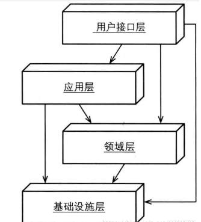

- # 领域驱动设计
- ### 值对象
  - 很多对象没有概念上的表示，他们描述了一个事务的某种特征。 用于描述领域的某个方面而本身没有概念表示的对象称为Value Object（值对象）
  - 在当前上下文很关键，没有唯一标识Id的,值对象是内聚并且可以具有行为(datetime就是一个值对象)  
  - 持久化问题，非关系型可以直接存josn，通过视图解析json查询
- ### 实体
  - 实体(Entity，又称为Reference Object) 很多对象不是通过他们的属性定义的，而是通过一连串的连续事件和标识定义的
  - 主要由标识定义的对象被称为ENTITY，有自己的唯一标识ID，还要许多属性和自己的行为
- ### 领域服务
  - 在某些情况下，最清楚、最实用的设计会包含一些特殊的操作，这些操作从概念上讲不属于任何对象。与其把它们强制地归于哪一类，不如顺其自然地在模型中引入一种新的元素，这就是Service（服务)
  - 领域中的某个要的过程或转换操作不属于实体或值对象的自然职责时，应该在模型中添加一个作为独立接口的操作，并将其声明为Service.定义接口时要使用模型语言，并确保操作名称是UBIQUITOUS LANGUAGE中的术语。此外，应该将Service定义为无状态的
  - 一些特殊的操作，这些操作从概念上讲不属于任何对象，领域服务中的操作，从领域的角度来看，领域服务是一个整体,（如果剥离了功能对他没影响）
	- RecommendFoodsService 推荐美食服务（到最后一个地方根据附近推荐美食是一个完整的领域服务）
- ### 应用服务
  - 应用服务是用来表达用例和用户故事（User Story)的主要手段
  - 应用层通过应用服务接口来暴露系统的全部功能。在应用服务的实现中，它负责编排和转发，它将要实现的功能委托给一个或多个领域对象来实现，它本身只负责处理业务用例的执行顺序以及结果的拼装
  - ItineraryApplicationService应用服务（推荐美食后并告知短信通知,推荐美食是领域服务，告知短信就是应用服务了）
- ### 聚合
  - 在具有复杂关联的模型中要想保证对象更改的一致性是很困难的。不仅互不关联的对象需要遵守一些固定规则，而且紧密关联的各组对象也要遵守一些固定规则。然而，过于谨慎的锁定机制又会导致多个用户之间臺无意义地互相干扰，从而使系统不可用
  - 首先，我们需要用一个抽象来封装模型中的引用。AGGREGATE就是一组相关对象的集合，我们把它作为数据修改的单元。每个AGGREGATE都有一个根(root)和一个边界(boundary).边界定义了AGGREGATE的内部都有什么。根则是AGGREGATE中所包含的一个特定Entity。在AGGREGATE中，根是唯一允许外部对象保持对它的引用的元素，而边界内部的对象之间则可以互相引用。除根以外的其他Entity都有本地标识，但这些标识只有在AGGREGATE内部才需要加以区别，因为外部对象除了根Entity之外看不到其他对象
  - 聚合根-行程和记账溥是一个整体，记一笔账，但是我们已经不能访问记账溥了，所以通过行程聚合根转移行为给记账溥
  - 考虑聚合根的重要一点是：在领域中我们是否会单独访问该实体，一个聚合在持久化的时候理应在一个事务中完成。但是当一个业务用例可能会操作多个聚合的时候，修改了聚合A的同时也更改了聚合B，这是一个很常见的操作，我们也必须保证多个聚合之间的一致性
  - 聚合是边界划分出来的结果，所以现在很多人会把微服务和DDD联系在一起，因为很有可能每一个划分出来的聚合就是一个微服务
- # 仓储
  - 为每种需要全局访问的对象类型创建一个对象，这个对象就相当于该类型的所有对象在内存中的一个集合的“替身”。通过一个众所周知的接口来提供访问。提供添加和删除对象的方法，用这些方法来封装在数据存储中实际插入或删除数据的操作。提供根据具体标准来挑选对象的方法，并返回属性值满足查询标准的对象或对象集合（所返回的对象是完全实例化的），从而将实际的存储和查询技术封装起来。只为那些确实需要直接访问的Aggregate提供Repository。让客户始终聚焦于型，而将所有对象存储和访问操作交给Repository来完成
  - 仓储是为聚合而服务的，存储库不是一个对象。它是一个程序边界以及一个明确的约定，在其上命名方法时它需要的工作量与领域模型中的对象所需的工作量一样多。你的存储库约定应该是特定的以及能够揭示意图并对领域专家具有意义
  - 仓储是一个明确的约定，宽泛的条件是没有意义的，让仓储层完全丧失了原有的作用，它反而成了负担，为什么不直接使用DbContext对象呢
  - 仓储接口是应该放在领域层的，而仓储的实现可以放在基础设施层
  
- ### 四层架构示意图
  - 
